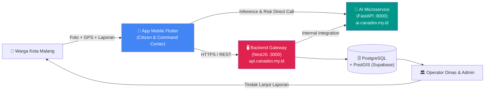
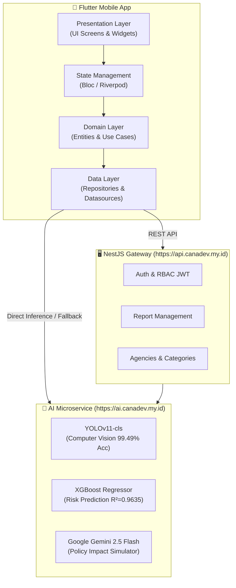

<div align="center">

# 🏛️ LaporKita — City Intelligence Platform

<p align="center">
  
  
  
  
  
  
  
</p>

> **"From Report to Resolve"** — Platform Pelaporan Kerusakan Infrastruktur Publik berbasis AI & Intelligence System untuk Kota Malang.
>
> Dikembangkan oleh **Tim Saya Akan Lawan — SMK Telkom Malang** untuk **MAGEITS Competition 2026**.

</div>

---

## 📑 Daftar Isi

- [🌐 Gambaran Umum Platform](#-gambaran-umum-platform)
- [🏛️ Arsitektur Sistem End-to-End](#️-arsitektur-sistem-end-to-end)
- [📱 Fitur Utama Aplikasi](#-fitur-utama-aplikasi)
  - [1. Modul Warga (Citizen App — B2C)](#1-modul-warga-citizen-app--b2c)
  - [2. Modul Pemerintah (Command Center — B2G)](#2-modul-pemerintah-command-center--b2g)
  - [3. Sistem Alert & Notifikasi Custom](#3-sistem-alert--notifikasi-custom)
- [🤖 Kapabilitas Kecerdasan Buatan (AI Microservice)](#-kapabilitas-kecerdasan-buatan-ai-microservice)
- [📁 Struktur Direktori & Arsitektur Kode](#-struktur-direktori--arsitektur-kode)
- [🌐 Endpoint Production & Konfigurasi Environment](#-endpoint-production--konfigurasi-environment)
- [🚀 Cara Menjalankan Aplikasi](#-cara-menjalankan-aplikasi)
- [🛠️ Pengujian Kode & Analisis](#️-pengujian-kode--analisis)
- [👥 Tim Pengembang](#-tim-pengembang)

---

## 🌐 Gambaran Umum Platform

**LaporKita** menghubungkan warga Kota Malang dengan pemerintah kota secara real-time melalui pendekatan **"From Report to Resolve"**. Aplikasi ini memiliki 2 peran utama:

1. **Warga (B2C)**: Melaporkan kerusakan jalan, drainase, trotoar, lampu jalan, dan rambu lalu lintas dalam **3 tap**, dilengkapi dengan verifikasi instan berbasis AI dan pelacakan progres transparan.
2. **Pemerintah / Command Center (B2G)**: Memantau kondisi kota melalui *Urban Health Score*, mengelola laporan berdasarkan prioritas otomatis (*Smart Priority*), serta mensimulasikan dampak kebijakan publik menggunakan Large Language Model (LLM).



---

## 🏛️ Arsitektur Sistem End-to-End

Aplikasi ini dibangun menggunakan arsitektur **Clean Architecture (Presentation → Domain → Data)** di sisi Flutter client untuk menjamin independensi antar layer dan skalabilitas tinggi.



---

## 📱 Fitur Utama Aplikasi

### 1. Modul Warga (Citizen App — B2C)

* **Autentikasi & Registrasi**:
  - Registrasi akun warga dengan verifikasi OTP 4-digit via SMS.
  - Login terintegrasi JWT Token dengan otomatisasi pengarahan role.
* **Kamera Laporan berbasis AI (Citizen Vision)**:
  - **3-Tap Flow**: Ambil Foto → Verifikasi AI → Kirim Laporan.
  - On-Device AI Hint yang dikirimkan ke server sebagai informasi pendukung.
  - Verifikasi otomatis server-side: Memeriksa Bounding Box Kota Malang, validasi timestamp, dan klasifikasi kerusakan ke 5 kelas (`Jalan Berlubang`, `Trotoar`, `Rambu Lalu Lintas`, `Lampu Jalan`, `Drainase`).
  - Menampilkan persentase **Confidence AI**, **Damage Severity**, **Urgency Score**, dan deskripsi rekomendasi otomatis dari AI.
* **Urban Risk Prediction (Prediksi Risiko Wilayah)**:
  - Card prediktif di beranda warga yang menampilkan kondisi cuaca real-time (hujan `mm`, suhu `°C`), persentase risiko banjir (%), dan badge level risiko dinamis (`RENDAH`, `SEDANG`, `TINGGI`).
* **Peta Interaktif Kerusakan (Urban Emotion Map)**:
  - Visualisasi zona warna tingkat stres wilayah dan pin laporan berbasis Google Maps SDK.
  - Filter interaktif laporan (Semua, Belum Diproses, Diproses, Selesai).
* **Tracking & Transparansi Laporan**:
  - Timeline status laporan secara real-time (`pending_verification` → `verified` → `assigned` → `in_progress` → `completed`).
  - Dukungan warga (*upvote/support*) dan fitur komentar antar warga.
  - Foto progres penanganan fisik oleh tim dinas terkait.

---

### 2. Modul Pemerintah (Command Center — B2G)

* **Urban Health Score Dashboard**:
  - Radial progress skor kesehatan kota (0–100) dan ringkasan angka laporan.
  - Pemantauan laporan prioritas tinggi berbasis algoritma *Smart Priority*.
* **Manajemen & Penugasan Laporan**:
  - Verifikasi manual laporan yang memerlukan peninjauan operator.
  - Penugasan laporan ke dinas teknis terkait (DPUPR, Dishub, Diskominfo).
* **Policy Simulator berbasis AI (Gemini 2.5 Flash)**:
  - Simulasi dampak alokasi anggaran dan skenario kebijakan infrastruktur publik.
  - Menghasilkan proyeksi penurunan insiden (%), waktu dampak, estimasi anggaran, dan langkah mitigasi risiko.

---

### 3. Sistem Alert & Notifikasi Custom

Aplikasi menggunakan komponen **`CustomAlertCard`** dan helper **`AppAlert`** yang didesain secara modern (*soft ambient glow & glassmorphism*):

| Tipe Alert | Warna Dominan | Pendaran Latar (Glow) | Ikon |
|---|---|---|---|
| **Information** | Soft Ocean Blue (`#0284C7`) | Light Cyan (`#E0F2FE`) | `Icons.info_outline_rounded` |
| **Success** | Vibrant Green (`#16A34A`) | Mint Green (`#DCFCE7`) | `Icons.check_circle_outline_rounded` |
| **Warning** | Warm Amber (`#D97706`) | Light Amber (`#FEF3C7`) | `Icons.warning_amber_rounded` |
| **Error** | Crimson Red (`#DC2626`) | Soft Rose (`#FEE2E2`) | `Icons.error_outline_rounded` |

---

## 🤖 Kapabilitas Kecerdasan Buatan (AI Microservice)

| Kapabilitas AI | Model ML / Architecture | Metrik Performa | Fungsi dalam Aplikasi |
|---|---|---|---|
| **Verifikasi Laporan** | **YOLOv11-cls** (Nano) | **99.49% Test Accuracy** (2.1 ms/image) | Klasifikasi 5 kelas kerusakan, validasi lokasi & keparahan |
| **Prediksi Risiko** | **XGBoost Regressor** | **R² = 0.9635**, MAE = 0.0369 | Estimasi risiko banjir & level stres infrastruktur wilayah |
| **Simulasi Kebijakan** | **Google Gemini 2.5 Flash** | Structured Pydantic JSON (Timeout 20s) | Proyeksi dampak alokasi anggaran & mitigasi risiko |

---

## 📁 Struktur Direktori & Arsitektur Kode

```
lib/
├── main.dart                          # Entry point aplikasi, route generator & provider setup
├── core/
│   ├── config/app_config.dart          # Base URL production & env overrides (--dart-define)
│   ├── network/                        # Dio client, ApiResponse envelope parser & error handler
│   ├── theme/                          # AppColors design tokens, AppTheme typography & theme data
│   └── utils/                          # Utility & helper classes
├── data/
│   ├── datasources/
│   │   └── remote/                     # auth_remote_datasource, report_remote_datasource, ai_service_datasource
│   ├── models/                         # DTO JSON model (report, user, category, ai_verification, risk_prediction)
│   └── repositories/                   # Implementasi repository (AuthRepository, ReportRepository, CategoryRepository)
├── domain/                             # Layer logika bisnis (Entities & Use Cases)
└── presentation/
    ├── auth/                           # Authentication Bloc (events & states)
    ├── citizen/
    │   ├── camera/                     # Camera capture, AI verification, report form & success screens
    │   ├── home/                       # SplashScreen, GetStartedScreen, CitizenHomeScreen, DashboardTab
    │   ├── map/                        # MapTabScreen (Interactive Google Maps & pin filters)
    │   ├── profile/                    # LoginScreen, SignUpScreen, OtpScreen, CitizenProfileTab
    │   ├── report_detail/              # ReportDetailScreen (timeline, comments, support)
    │   └── tracking/                   # TrackingProgressScreen & FotoProgressScreen
    ├── command_center/
    │   └── dashboard/                  # CommandCenterDashboard (B2G Command Center interface)
    └── shared_widgets/                 # CustomAlertCard (AppAlert), StatusBadge, ReportCard, RadialProgress
```

---

## 🌐 Endpoint Production & Konfigurasi Environment

Aplikasi ini sudah terkonfigurasi dengan URL produksi secara default di [app_config.dart](lib/core/config/app_config.dart):

```dart
class AppConfig {
  /// Backend REST API Gateway (NestJS)
  static const String baseUrl = String.fromEnvironment(
    'API_BASE_URL',
    defaultValue: 'https://api.canadev.my.id/api/v1',
  );

  /// AI Microservice (FastAPI Python)
  static const String aiServiceUrl = String.fromEnvironment(
    'AI_SERVICE_URL',
    defaultValue: 'https://ai.canadev.my.id',
  );
}
```

### Opsi Dynamic Environment Override (opsional):
```bash
flutter run --dart-define=API_BASE_URL=https://api.canadev.my.id/api/v1 --dart-define=AI_SERVICE_URL=https://ai.canadev.my.id
```

---

## 🚀 Cara Menjalankan Aplikasi

### Prasyarat
- **Flutter SDK**: `>=3.19.0` (Dart SDK `>=3.3.0`)
- **Android Studio / VS Code** (dengan ekstensi Flutter & Dart)
- Device fisik Android / iOS atau Emulator aktif

### Langkah Instalasi & Memulai

```bash
# 1. Clone repository
git clone https://github.com/nabilkencana/laporkita.git
cd laporkita

# 2. Install dependensi Flutter
flutter pub get

# 3. Jalankan analisis kode
flutter analyze

# 4. Jalankan aplikasi di device/emulator
flutter run
```

### Build APK Produksi (Android)

```bash
flutter build apk --release
```

---

## 🛠️ Pengujian Kode & Analisis

Aplikasi ini dipelihara dengan standar kualitas kode yang ketat:
- **Flutter Analyze**: `0 Error`, `0 Warning`.
- **Clean Architecture & Null Safety**: Menggunakan fitur Dart 3.x *null-safety* secara penuh.
- **Handling Exception**: Penanganan `ScaffoldMessenger` dan `BuildContext` aman dari memori leak dan *deactivated widget errors*.

---

## 👥 Tim Pengembang

**Tim Saya Akan Lawan — SMK Telkom Malang**
- Platform Development & Mobile Engineering (Flutter & Dart)
- Backend Architecture & API Gateway (NestJS & Prisma)
- AI & Computer Vision Engineering (FastAPI, YOLOv11, XGBoost, Gemini)

*Built with ❤️ for Kota Malang · MAGEITS Competition 2026*
